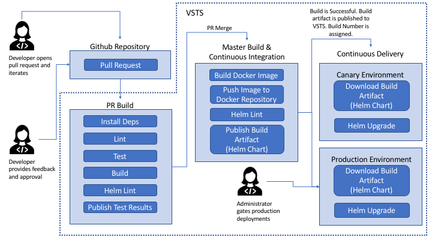

# Continuous Integration/Deployment

## Overview



Continuous Integration/Deployment (CI/CD) is a systematic way to give feedback, iterate, and deploy your changes into your environments. CI/CD can be used to gather telemetry on code changes in a quick and predictable manner.

This solution architecture hooks in Visual Studio Team Services (vsts) into github and uses build phases to gate code checkins into the master branch.

## Flow

### Pull Requests

The feature developer will submit their feature branch and request a `pull request` (PR) against the master branch on `github`. Interested developers will provide feedback and work with the feature developer on implementational changes.

As the feature developer begins making iterations, each additional update to the feature branch will result in a PR build. Some typical steps in this build involve testing, building, and linting the code to ensure no regressions were introduced.

Both parties will continue to iterate on this pull request until they have reached an agreement. Interested developers will provide their approval.

### Continuous Integration

Once the pull request has been merged, `continuous integration` will start. A docker image will be built using the most recent `Dockerfile`. Multi-stage docker builds are used to install image dependencies and utilize docker caching.

The newly built docker image will be semantically versioned.
```
major.minor.buildNumber

example:
1.0.52
```

The docker image will be published to the associated azure container registry using the semantic version as the image tag.

Once the image is published, the helm chart that is responsible for deploying these resources will be published as a `build artifact`.

### Continuous Deployment

On every successful build, continuous delivery is kicked off. Our reference architecture supports a `canary` and `stable` releases.

`Canary` releases are deployed to the cluster on each successful build. This will ensure that changes are constantly delivered and high deployment velocity is available.

`Stable` releases are typically a couple versions behind `canary` and the images are deemed stable for production. This will ensure that changes are highly available. Our solution requires an administrator to sign off on `stable` deployments. Rollbacks are easily accessible since each build is versioned.

## Creating Continuous Integration

Each Repository requires 2 Build Definitions: one for PRs and one for master builds.

### Prerequisites

This guide will cover executing continuous integration and deployment with hosted build/release agents. Another option is to register your own machines into the agent pool. Your own private agents must have all the project dependencies. This would include the [deployment prerequisites](README.md#Development-Prerequisites). This guide will not cover [private agents](https://docs.microsoft.com/en-us/vsts/build-release/concepts/agents/agents?view=vsts).

#### Hosted Build/Release Agents

Hosted agents come with great tooling baked into each image. See [here](https://github.com/Microsoft/vsts-agent-docker/blob/master/ubuntu/16.04/standard/Dockerfile) for all the pre-installed dependencies on the `linux build agent`.

However, hosted build agents do not come equiped with `helm` and `kubectl` which we use to deploy the services. We will be using a 3rd party `kubernetes` exntesion

Install a marketplace [Kubernetes extension task](https://marketplace.visualstudio.com/items?itemName=tsuyoshiushio.k8s-endpoint) onto your VSTS. Follow the documentation to add your cluster.

### Pull Request Builds

1. Create new build definition.
    

2. Select GitHub as the source and authenticate with a valid github account. This should ideally be a service github account used only for the builds.
    

3. Once authenticated, select the repository and the branch this build will service. Begin the build as an empty process.
    

4. Select your build agent pool or select a hosted agent that fits the OS you would like to build with.
    

5. Add the appropriate build tasks that PRs should pass before being merged in. Some examples include running tests, linting code, installing dependencies, or building the typescript source code.
    

6. Once the appropriate build has been setup, navigate to `Triggers` and connect the repo with this build as a pull request validator.
    

### Master Builds

1. Refer to steps 1-4 on section [Pull Request Builds](#Pull-Request-Builds)

2. Add build variables by navigating to `Variables` and add the following variables: `DockerImageName`, `MajorVersion`, and `MinorVersion`. The build will use these variables to semantically version the docker images within `Azure Container Registry`.
    


3. Navigate to `Options` and add `$(MajorVersion).$(MinorVersion)$(Rev:.r)` as the `Build number format`. This will ensure the build properly versions the docker images.
    

4. Add a task for building a docker image.

    Complete the following tasks:
    - Add Azure Subscription Id
    - Select Azure Container Registery
    - Select `Build an image` as the `Action`
    - Select the `Dockerfile` that will be used to build the image.
    - Ensure use Default Build Context is selected.
    - Add the `$(DockerImageName):$(Build.BuildNumber)` as the `Image Name`.

    

5. Add a task for publishing a docker image.

    Complete the following tasks:
    - Add Azure Subscription Id
    - Select Azure Container Registery
    - Select `Push an image` as the `Action`
    - Select the `Dockerfile` that will be used to build the image.
    - Ensure use Default Build Context is selected.
    - Add the `$(DockerImageName):$(Build.BuildNumber)` as the `Image Name`.

    

6. Add a task to Publish the build Artifact. The published artifact will be consumed in `Continuous Deployment`. In our case, this is helm chart used for deployment.

    Complete the following tasks:
    - Pick a path to publish
    - Name the artifact
    - Select `Visual Studio Team Services/TFS` as the `Artifact publish location`.

    


7. Navigate to `Triggers` and enable Continuous Integration. This build definition will now trigger when there are new changes in the master branch.
    

## Creating Continuous Deployment

Each deployable service will require a release definition. Multiple environments can be handled with a single release definition.

1. Create new release definition. Begin with an empty process.
    

2. Add an `artifact` and select `Build` as the Source type.

    Complete the following tasks:
    - Add Project
    - Select the source build definition.
    - Select `Latest` as the `Default version`.
    - Take note of `Source alias` this will be used during deployment.

    

3. Select your release agent pool or select a hosted agent that fits the OS you would like to deploy with.
    

4. Add a helm task and run `helm upgrade -i`