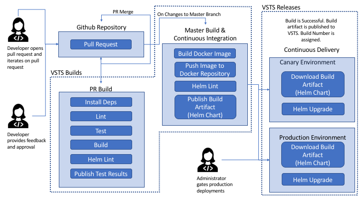

# Continuous Integration/Deployment

## Overview



Continuous Integration/Deployment (CI/CD) is a systematic way to give feedback, iterate, and deploy your changes into your environments. CI/CD can be used to gather telemetry on code changes in a quick and predictable manner.

This solution architecture hooks in Visual Studio Team Services (vsts) into github and uses build phases to gate code checkins into the master branch.

## Flow

### Pull Requests

The feature developer will submit their feature branch and request a `pull request` (PR) against the master branch on `github`. Interested developers will provide feedback and work with the feature developer on implementational changes.

As the feature developer begins making iterations, each additional update to the feature branch will result in a PR build. Some typical steps in this build involve testing, building, and linting the code to ensure no regressions were introduced.

Both parties will continue to iterate on this pull request until they have reached an agreement. Interested developers will provide their approval.

### Continuous Integration

Once the pull request has been merged, `continuous integration` will start. A docker image will be built using the most recent `Dockerfile`. Multi-stage docker builds are used to install image dependencies and utilize docker caching.

The newly built docker image will be semantically versioned.
```
major.minor.buildNumber

example:
1.0.52
```

The docker image will be published to the associated azure container registry using the semantic version as the image tag.

Once the image is published, the helm chart that is responsible for deploying these resources will be published as a `build artifact`.

### Continuous Deployment

On every successful build, continuous delivery is kicked off. Our reference architecture supports a `canary` and `stable` releases.

`Canary` releases are deployed to the cluster on each successful build. This will ensure that changes are constantly delivered and high deployment velocity is available.

`Stable` releases are typically a couple versions behind `canary` and the images are deemed stable for production. This will ensure that changes are highly available. Our solution requires an administrator to sign off on `stable` deployments. Rollbacks are easily accessible since each build is versioned.