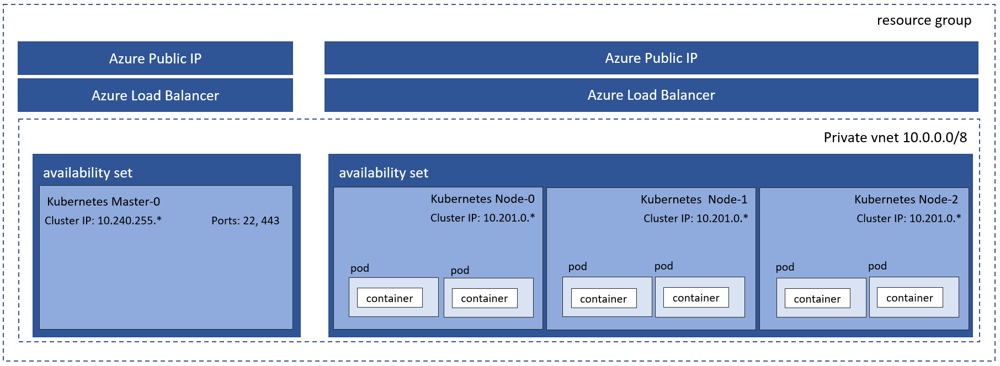

# Deployment

## Deploying to an Azure Subscription for the first time

If you are setting up a new micro-service pipeline from scratch, you will need to deploy all of the foundational, shared Azure resources that are necessary to support the k8 solution in Azure. All of these resources are deployed via the inception.sh script provided in this solution.

The following resources are deployed by inception.sh:

- Azure Resource Group for all common resources
- Azure Traffic Manager profile
- KeyVault to store common resource secrets
- Azure Container Registry for storing micro-service docker images
- Azure SQL Database for backend data
- Application Insights instance
- Log Analytics workspace
- Service Principal for KeyVault access

### Create initial common Azure resources

**These resources should only be created one time per subscription** and are common resources used by all micro-services.

#### Step 1: configure environment variables

Open /deployment/globalVariables.sh and enter values for the deployment.

#### Step 2: Configure SSH keys

A private / public certificate key pair is required to setup the k8 cluster so client dev and ops engineers can connect to the cluster after deployment.

- Generate new [SSH keys](https://github.com/Azure/acs-engine/blob/master/docs/ssh.md#ssh-key-generation/) and save it in /deployment as `cluster_rsa.pub` and `cluster_rsa`
- Update `clusterDefinition.json` with the public key contained in `cluster_rsa.pub`. `keyData` must contain the public portion of an SSH key (e.g. 'ssh-rsa AAAAB3NzaC1yc2EAAAADAQABA....')

#### Step 3: Execute inception.sh

Open a bash shell and execute inception.sh

```bash
cd /deployment
chmod 775 *
./inception.sh
```

Copy the values for the following variables from the inception script output file - inception.txt, you will need these in deployCluster.sh. You might want to save inception.txt somewhere safe as you will need it in the future to deploy additional clusters.

```shell
K8_DEPLOYMENT_KEYVAULT_NAME
AZURE_CONTAINER_REGISTRY_NAME
AZURE_TRAFFIC_MANAGER_PROFILE_NAME
MT_CONNECTION_STRING
AZURE_TRAFFIC_MANAGER_PROFILE_NAME
```

## Deploying a k8 cluster

Multiple k8 clusters can be deployed, each in their own resource group and with their own endpoint. Each time you run deployCluster.sh a new resource group will be provisioned and all resources specific for that cluster will be deployed.

The following resources are deployed by deployCluster.sh:

- Azure Resource Group specific to the cluster
- Service Principal to serve as the cluster identity
- Permissions to access common resources
- [ACS Engine](./deployment/acs-engine.md) based k8 cluster (1 master | 3 nodes)
- [Helm](https://www.helm.sh/)
- [Traefik](https://docs.traefik.io/user-guide/kubernetes/)
- Azure Traffic Manager endpoint to cluster

The following diagram shows the **physical artifacts** created in the resource group.


### Step 1: Edit deployCluster.sh

Fill out the following values....

Name of the cluster (must be unique):

```shell
CLUSTER_NAME=
```

Use the values from inception.txt to populate the following:

```shell
AZURE_CONTAINER_REGISTRY_NAME=
K8_DEPLOYMENT_KEYVAULT_NAME=
AZURE_TRAFFIC_MANAGER_PROFILE_NAME=
```

### Execute deployCluster.sh

Open a bash shell and execute deployCluster.sh

```bash
cd /deployment
./deployCluster.sh
```