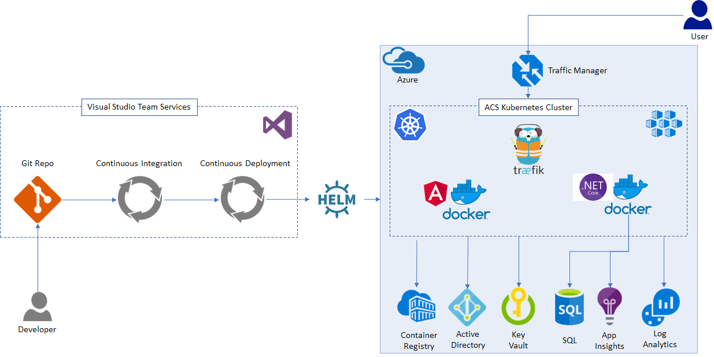

# Containerized Micro-services

This project is a reference solution for building out a full Production ready micro-services solution. This solution is hosted in Kubernetes running on Azure. All apps and services have a small (micro-service) footprint of responsibilities and are run in Docker containers. This solution is meant to be a best practice example of a micro-service development and hosting solution ready for Production.

## Solution Overview

- Cross platform solution (runs on Linux, Windows and Mac)
- Source repositories hosted in Git
- Continuous Integration (CI) including unit & integration tests via [VSTS](https://www.visualstudio.com/team-services/) (Visual Studio Team Services)
- Continuous Deployment (CD) via [VSTS](https://www.visualstudio.com/team-services/)
- Containerized services hosted in Kubernetes (k8)
- Secrets management via [Azure KeyVault](https://azure.microsoft.com/en-us/services/key-vault/), [k8 secrets](https://kubernetes.io/docs/concepts/configuration/secret/) and [Hexadite](https://github.com/Hexadite/acs-keyvault-agent)
- [Azure Active Directory Service Principal identities](https://docs.microsoft.com/en-us/azure/active-directory/develop/active-directory-application-objects) and least privilege access policies
- [Helm chart](https://helm.sh/) k8 package deployments
- [Azure Traffic Manager](https://azure.microsoft.com/en-us/services/traffic-manager/) DNS request routing
- [Traefik ingress controller](https://github.com/kubernetes/charts/tree/master/stable/traefik) k8 traffic routing
- [Canary deployments](https://kubernetes.io/docs/concepts/cluster-administration/manage-deployment/#canary-deployments)
- Azure k8 cluster deployment via [ACS Engine](https://github.com/Azure/acs-engine/blob/master/docs/kubernetes/features.md)
- [Application Insights](https://azure.microsoft.com/en-us/services/application-insights/) telemetry
- [Log Analytics](https://azure.microsoft.com/en-us/services/log-analytics/) k8 cluster health dashboard



## Included in this Solution

### Deployment scripts

[Deployment scripts](https://github.com/Microsoft/containerized-microservices-pipeline/tree/master/deployment)

Deployment scripts are provided as part of the reference solution that will setup a new Azure Subscription with all of the necessary resources, create Azure Active Directory Service Principal service accounts, grant needed access and deploy out n number of k8 clusters. Documentation for CI / CD setup in VSTS is provided to enable you to get a full end-to-end pipeline micro-service pipeline setup in no time.

### Example Angular app micro-service

[https://github.com/Microsoft/containerized-microservices-pipeline-app](https://github.com/Microsoft/containerized-microservices-pipeline-app)

An example front end web app written in Angular is provided as part of the solution, including a suite of unit and integration tests that are run when a Pull Request is created for a robust CI process. Changes to the app micro-service is automatically deployed to the canary pods as part of the CD process.

### Example .NET Core api micro-service

[https://github.com/Microsoft/containerized-microservices-pipeline-service](https://github.com/Microsoft/containerized-microservices-pipeline-service)

An example cross platform middle tier api is provided as part of the solution, including a suite of unit and integration tests that are run when a Pull Request is created for a robust CI process. Changes to the api micro-service is automatically deployed to the canary pods as part of the CD process.

## Development Prerequisites

1. Mac - Homebrew
    - [Installing homebrew](https://brew.sh/)
2. Windows - Powershell & Linux Subsystem
    - [Installing Windows Powershell](https://docs.microsoft.com/en-us/powershell/scripting/setup/installing-windows-powershell?view=powershell-6)
    - [Installing the Linux Subsystem on Windows](https://docs.microsoft.com/en-us/windows/wsl/install-win10)
3. Docker
    - [Install on Mac](https://docs.docker.com/docker-for-mac/install/)
    - [Install on Windows](https://store.docker.com/editions/community/docker-ce-desktop-windows)
        - Select the "Use Windows containers ..." option
        - After rebooting, you will be prompted to login to Docker.  You can create a personal username and pasword here.        
4. Azure CLI
    - Install Azure CLI on Mac with Homebrew
        ```bash
        brew install
        brew install azure-cli
        ```
    - Install Azure CLI on Windows: [Download and run AZ Installer](https://aka.ms/InstallAzureCliWindows)
        - [For more information on installing Azure CLI](https://docs.microsoft.com/en-us/cli/azure/install-azure-cli?view=azure-cli-latest)
5. kubectl
    - Install kubectl on Mac with Homebrew
        ```bash
        brew install kubectl
        ```
    - Install kubectl on Windows with PowerShell
        ```powershell
        Install-Script -Name install-kubectl -Scope CurrentUser -Force
        install-kubectl.ps1 -DownloadLocation <path>
            - where <path> is the location you wish to install it. 
            - you may be prompted to install a new version of nuget.  do it. 
        ```
6. ACS Engine
    - [Download and install ACS Engine](https://github.com/Azure/acs-engine/blob/master/docs/acsengine.md#install)
        - be sure and put (or add) acs-engine.exe to your $PATH

7. JQ
    - [Download and install JQ](https://stedolan.github.io/jq/download/)
        - note: the jq-win64.exe is *not* an installation program. it is the uncompressed EXE.  Copy it to someplace on your $PATH

## Deploying Azure Resources and ACS Kubernetes Cluster

[Deployment](Deployment.md)

## Securing Secrets

[Deploying secrets to production](SecuringSecrets.md)

## Contributing

This project welcomes contributions and suggestions.  Most contributions require you to agree to a
Contributor License Agreement (CLA) declaring that you have the right to, and actually do, grant us
the rights to use your contribution. For details, visit https://cla.microsoft.com.

When you submit a pull request, a CLA-bot will automatically determine whether you need to provide
a CLA and decorate the PR appropriately (e.g., label, comment). Simply follow the instructions
provided by the bot. You will only need to do this once across all repos using our CLA.

This project has adopted the [Microsoft Open Source Code of Conduct](https://opensource.microsoft.com/codeofconduct/).
For more information see the [Code of Conduct FAQ](https://opensource.microsoft.com/codeofconduct/faq/) or
contact [opencode@microsoft.com](mailto:opencode@microsoft.com) with any additional questions or comments.
