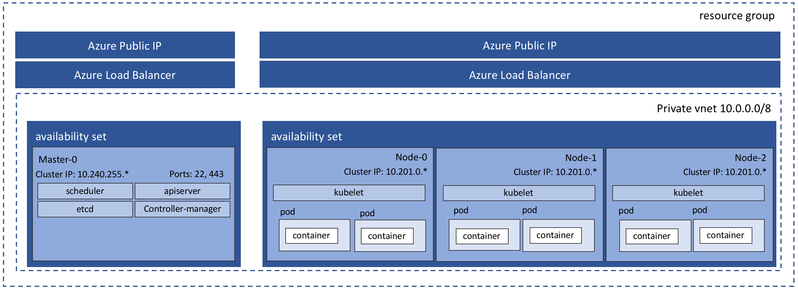

# Containerized Microservices

This project is a reference solution for building out a full Production ready micro-services solution. This solution is hosted in Kubernetes running on Azure. All apps and services have a small (micro-service) footprint of responsibilities and are run in Docker containers. This solution is meant to be a best practice example of a micro-service development and hosting solution ready for Production.

## Solution Highlights

- Cross platform solution (runs on Linux, Windows and Mac)
- Source repositories hosted in Git
- Continuous Integration (CI) including unit & integration tests via [VSTS](https://www.visualstudio.com/team-services/) (Visual Studio Team Services)
- Continuous Deployment (CD) via [VSTS](https://www.visualstudio.com/team-services/)
- Containerized services hosted in Kubernetes (k8)
- Secrets management via [Azure KeyVault](https://azure.microsoft.com/en-us/services/key-vault/), [k8 secrets](https://kubernetes.io/docs/concepts/configuration/secret/) and Hexodite
- [Azure Active Directory Service Principal identities](https://docs.microsoft.com/en-us/azure/active-directory/develop/active-directory-application-objects) and least privilege access policies
- [Helm chart](https://helm.sh/) k8 package deployments
- [Azure Traffic Manager](https://azure.microsoft.com/en-us/services/traffic-manager/) DNS request routing
- [Traefik ingress controller](https://github.com/kubernetes/charts/tree/master/stable/traefik) k8 traffic routing
- [Canary deployments](https://kubernetes.io/docs/concepts/cluster-administration/manage-deployment/#canary-deployments)
- Azure k8 cluster deployment via [ACS Engine](https://github.com/Azure/acs-engine/blob/master/docs/kubernetes/features.md)
- Application Insights telemetry
- Log Analytics k8 cluster health dashboard

## Included in this Solution

### Deployment scripts

Deployment scripts are provided as part of the reference solution that will setup a new Azure Subscription with all of the necessary resources, create Azure Active Directory Service Principal service accounts, grant needed access and deploy out n number of k8 clusters. Documentation for CI / CD setup in VSTS is provided to enable you to get a full end-to-end pipeline micro-service pipeline setup in no time.

### Example Angular app micro-service

An example front end web app written in Angular is provided as part of the solution, including a suite of unit and integration tests that are run when a Pull Request is created for a robust CI process. Changes to the app micro-service is automatically deployed to the canary pods as part of the CD process.

### Example .NET Core api micro-service

An example cross platform middle tier api is provided as part of the solution, including a suite of unit and integration tests that are run when a Pull Request is created for a robust CI process. Changes to the api micro-service is automatically deployed to the canary pods as part of the CD process.

## Development Prerequisites

### Mac - Homebrew

[How to install homebrew](https://brew.sh/)

### Windows - Powershell & Linux Subsystem

[Installing Windows Powershell](https://docs.microsoft.com/en-us/powershell/scripting/setup/installing-windows-powershell?view=powershell-6)

[Installing the Linux Subsystem on Windows](https://docs.microsoft.com/en-us/windows/wsl/install-win10)

### Install Docker

#### Install on Mac

[Docker CE](https://docs.docker.com/docker-for-mac/install/)

#### Install on Windows

[Docker CE](https://docs.docker.com/docker-for-windows/install/)

### Install Azure CLI

#### Install on Mac with Homebrew

```
brew install
brew install azure-cli
```

#### Install on Windows

Download and run [AZ Installer](https://aka.ms/InstallAzureCliWindows)

[For more information on installing Azure CLI](https://docs.microsoft.com/en-us/cli/azure/install-azure-cli?view=azure-cli-latest)

### Install Kubectl

#### Install on Mac with Homebrew

```
brew install kubectl
```

#### Install on Windows with PowerShell

```
Install-Script -Name install-kubectl -Scope CurrentUser -Force
install-kubectl.ps1 [-DownloadLocation <path>]
```

### Install ACS Engine

[Download and install ACS Engine](https://github.com/Azure/acs-engine/blob/master/docs/acsengine.md#install)

### Install JQ

[Download and install JQ](https://stedolan.github.io/jq/download/)

## Deploying to an Azure Subscription for the first time

If you are setting up a new micro-service pipeline from scratch, you will need to deploy all of the foundational, shared Azure resources that are necessary to support the k8 solution in Azure. All of these resources are deployed via the inception.sh script provided in this solution.

The following resources are deployed by inception.sh:

- Azure Resource Group for all common resources
- Azure Traffic Manager profile
- KeyVault to store common resource secrets
- Azure Container Registry for storing micro-service docker images
- Azure SQL Database for backend data
- Application Insights instance
- Log Analytics workspace
- Service Principal for KeyVault access

### Create initial common Azure resources

**These resources should only be created one time per subscription** and are common resources used by all micro-services.

#### Step 1: configure environment variables

Open /deployment/globalVariables.sh and enter values for the deployment.

#### Step 2: Configure SSH keys

A private / public certificate key pair is required to setup the k8 cluster so client dev and ops engineers can connect to the cluster after deployment.

- Generate new [SSH keys](https://github.com/Azure/acs-engine/blob/master/docs/ssh.md#ssh-key-generation/) and save it in /deployment as `cluster_rsa.pub` and `cluster_rsa`
- Update `clusterDefinition.json` with the public key contained in `cluster_rsa.pub`. `keyData` must contain the public portion of an SSH key (e.g. 'ssh-rsa AAAAB3NzaC1yc2EAAAADAQABA....')

#### Step 3: Execute inception.sh

Open a bash shell and execute inception.sh

```
cd /deployment
chmod 775 *
./inception.sh
```

Copy the values for the following variables from the inception script output file - inception.txt, you will need these in deployCluster.sh. You might want to save inception.txt somewhere safe as you will need it in the future to deploy additional clusters.

```
K8_DEPLOYMENT_KEYVAULT_NAME
AZURE_CONTAINER_REGISTRY_NAME
AZURE_TRAFFIC_MANAGER_PROFILE_NAME
MT_CONNECTION_STRING
AZURE_TRAFFIC_MANAGER_PROFILE_NAME
```

## Deploying a k8 cluster

Multiple k8 clusters can be deployed, each in their own resource group and with their own endpoint. Each time you run deployCluster.sh a new resource group will be provisioned and all resources specific for that cluster will be deployed.

The following resources are deployed by deployCluster.sh:

- Azure Resource Group specific to the cluster
- Service Principal to serve as the cluster identity
- Permissions to access common resources
- [ACS Engine](./deployment/acs-engine.md) based k8 cluster (1 master | 3 nodes)
- Helm
- Traefik
- Azure Traffic Manager endpoint to cluster

The following diagram shows the **physical artifacts** created in the resource group.


#### Step 1: Edit deployCluster.sh

Fill out the following values....

Name of the cluster (must be unique):

```
CLUSTER_NAME=
```

Use the values from inception.txt to populate the following:

```
AZURE_CONTAINER_REGISTRY_NAME=
K8_DEPLOYMENT_KEYVAULT_NAME=
AZURE_TRAFFIC_MANAGER_PROFILE_NAME=
```

#### Execute deployCluster.sh

Open a bash shell and execute deployCluster.sh

```
cd /deployment
./deployCluster.sh
```

# Securing secrets

[Deploying secrets to production](SecretsDeployment.md)

# Contributing

This project welcomes contributions and suggestions.  Most contributions require you to agree to a
Contributor License Agreement (CLA) declaring that you have the right to, and actually do, grant us
the rights to use your contribution. For details, visit https://cla.microsoft.com.

When you submit a pull request, a CLA-bot will automatically determine whether you need to provide
a CLA and decorate the PR appropriately (e.g., label, comment). Simply follow the instructions
provided by the bot. You will only need to do this once across all repos using our CLA.

This project has adopted the [Microsoft Open Source Code of Conduct](https://opensource.microsoft.com/codeofconduct/).
For more information see the [Code of Conduct FAQ](https://opensource.microsoft.com/codeofconduct/faq/) or
contact [opencode@microsoft.com](mailto:opencode@microsoft.com) with any additional questions or comments.