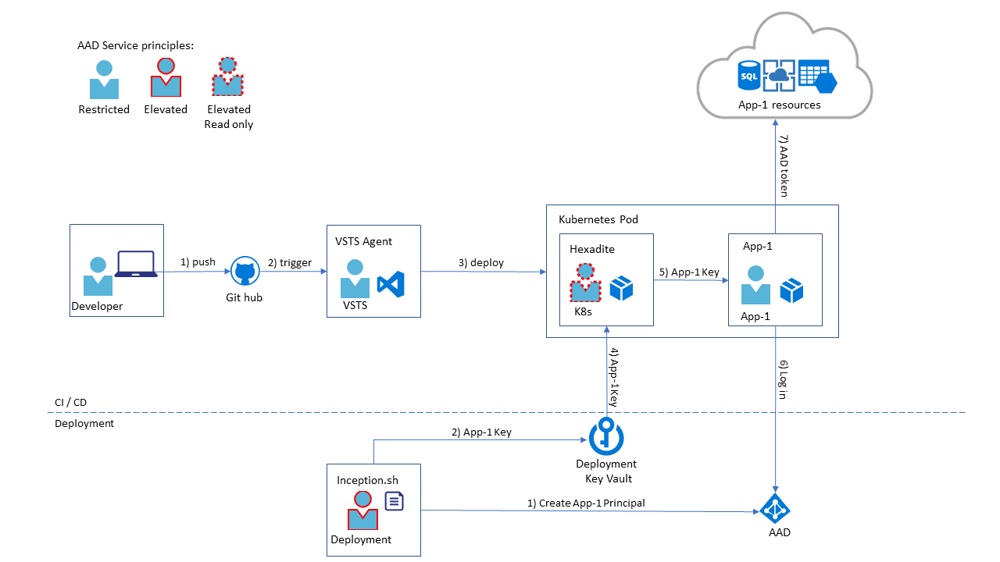

# Deploying Secrets to Production
One of the security challanges is deploying secrets to production.

To achive basic security the secrets are stored in Azure Key Vault only, they are never checked-in together with the source code and are not accessible to personnel without explicit privileges.

The main Key Vault is called Deployment Key Vault. [Hexadite Azure Key Vault Agent]( https://github.com/Hexadite/acs-keyvault-agent) is used to securely pass secrets from the Deployment Key Vault down to the applications. To ensure secure secrets handling, the priveleges to the Deployment Key Vault are granted only to two Azure AD principles, see the description below.

There are 5 Azure Active Directory principles participating in the initial deployment and regular development CI/CD processes:
- Deployment - the principle that creates application AAD passwords initially and the only principle having write permissions to the Deployment Key Vault.
- K8s - Kubernetes root principle, has read only access to the Deployment Key Vault.
- Application, e.g. App-1 on the diagram. Doesn't have any access to the Deployment Key Vault, obtains its password from Hexadite.
- VSTS - VSTS CI/CD agent principle. Can deploy into Kubernetes but doesn't have any access to the passwords.
- Developer - doesn't have any access to the clusters and passwords.

## Deployment data flow

### Initial Deployment sequence
At the initial deployment stage inception.sh script creates (1) a service principle for each application and puts (2) their passwords into Key Vault with the read access granted to Kubernetes internal root AAD principle (K8s).

### CI/CD Development process
During daily routine developers push (1) their changes to the github, triggering (2) VSTS agent CI/CD pipeline process. If the new build is ready for the deployment VSTS agent deploys (3) new images to the production Kubernetes cluster. Hexadite is the Kubernetes init container on the application pod reading (4) application key from the Deployment Key Vault and makes it securely accessible to the application (see Hexadite documentation for the details). Application can read (5) its password only and uses it to obtain AAD token (6) from the AAD. Having the token the application can access all other Azure resources (7) like storage accounts, application key vaults, etc. 

Note: as of now, AAD authentication to Azure SQL is not available in .Net Core. The recommendation is to store SQL password in an application accessible Key Vault. Application can access it using AAD authentication and then, use the password stored in the Appication Key Vault to access the SQL.