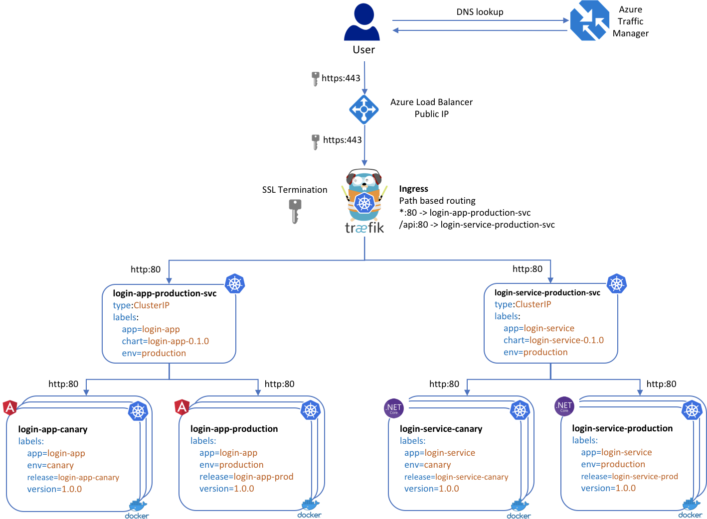

# Traffic Routing

## Azure Traffic Manager

[Azure Traffic Manager](https://azure.microsoft.com/en-us/services/traffic-manager/) provides global DNS endpoint resolution for public requests to the Kubernetes cluster running in Azure. Traffic Manager provides several benefits, including:

- Nearest geographic proximity based routing
- Global failover
- Weighted routing between different clusters

## Azure Load Balancer

An Azure load balancer provides a public IP and the entry point for all public requests to the Kubernetes cluster. The Azure Traffic Manager endpoint for the cluster has a CNAME record pointing to the Azure Load Balancer public IP.

## Traefik Ingress Controller

A [Traefik ingress controller](https://github.com/kubernetes/charts/tree/master/stable/traefik) is used within the Kubernetes cluster for traffic routing. Traefik provides flexibility to desribe routes as code and review any routing changes before they are applied. Traefik requieres a single public IP on the Azure Load Balancer and can handle routing all requests for the pods in the Kubernetes cluster based on hostname, paths and/or ports.

**Traefik also handles ssl termination** for the Kubernetes cluster. This enables the SSL certificate to be deployed to a single location and ensures that all traffic will travel over HTTPS into the Kubernestes cluster.

## Kubernetes Services

Traefik routes all requests to Kubernetes services, which act as internal load balancers in Kubernetes. **Since we are using Traefik, the Kubernetes services be of type ClusterIP**, which makes them accessible from within the cluster only and prevents exposing services directly to public requests.